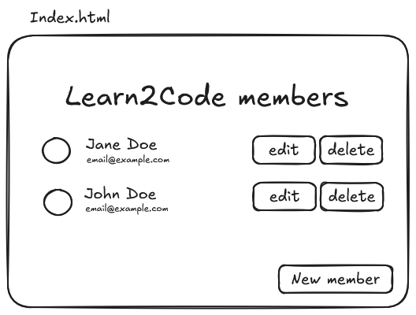
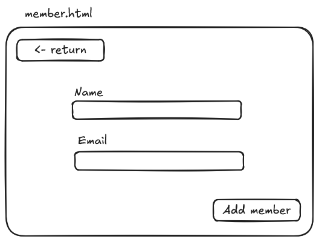
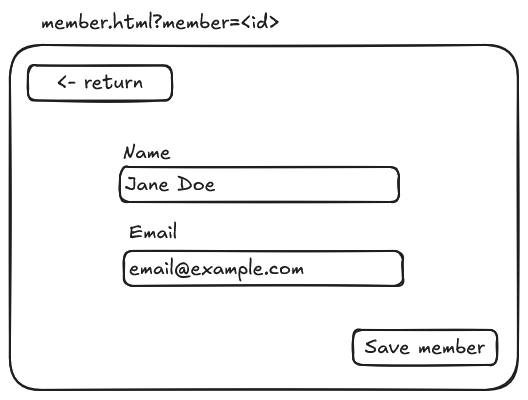

# Gestion Du Club Informatique

<!-- TODO: AJOUTER UNE DESCRIPTION DU PROJET ICI -->

## Getting Started

### XAMPP/WAMP

- Start the PHP server.
- Setup the database using phpmyadmin or whatever you use.

#### phpmyadmin (if using XAMPP)

- Import the file from `db/club_informatique.sql` into a database

### Docker

- Start the docker compose container.

```
docker compose up -d
```

- Setup the database using adminer.

#### adminer

- Access adminer on `localhost:8080`
- Connect using `Username:root`, `Password:mariadb`, `Database:database`
- Go to SQL command
- Copy paste file content from `db/init.sql`
- Execute the SQL using the button `Execute`

### Development

Do not forget to use your own branch to avoid conflict with other people's work.

```
git pull
git branch feat/<NOM_DU_FEATURE>
git checkout feat/<NOM_DU_FEATURE>
git push --set-upstream origin feat/<NOM_DU_FEATURE>
```

## Screen

### Index



### New member



### Edit member



## Contributors

List of contributors on this project.

- Ryuka25 (https://github.com/Ryuka25)
- RalisataRelahy(https://github.com/RalisataRelahy)
- manoyfinaritra (https://github.com/manoyfinaritra)
- NalyTahiana (https://github.com/NalyTahiana)
